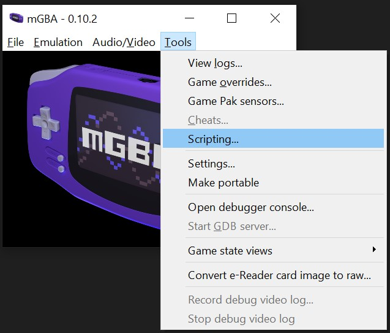
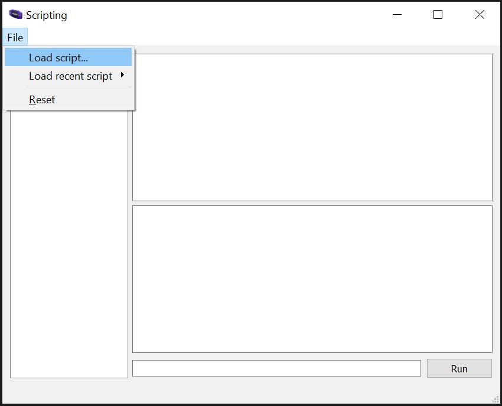
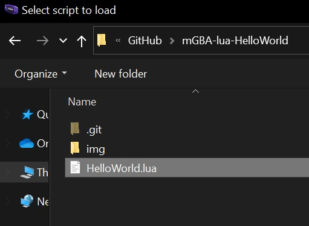
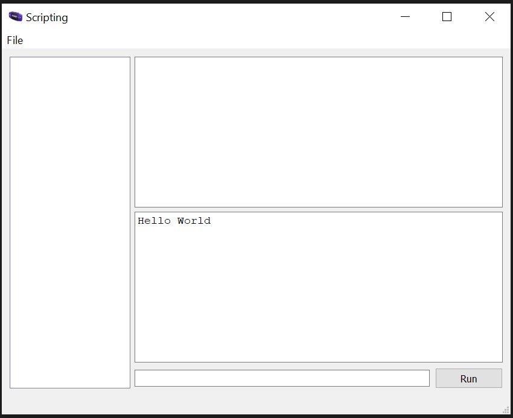

# mGBA lua Hello World
Simple hello world using lua with mGBA.

## How to run
1. Get the `HelloWorld.lua` file from this repository.
1. Open mGBA.
1. Click `Tools > Scripting` to open the Scripting window.

1. In the scripting window click `File > Load script` to bring up the file picker dialog.

1. Select `HelloWorld.lua` from where you saved it.

1. The Hello World script will automatically run to display the "Hello World" message.

Note: The `Run` button and input are used similar to a REPL - it won't rerun your script unless you load it again via the `File` options. 

## Documentation 
Scripting documentation can be found on the [mGBA Scripting Docs page](https://mgba.io/docs/scripting.html). 

The `console:log` documentation used in this demo is found under the [console documentation section](https://mgba.io/docs/scripting.html#method-Console.log).